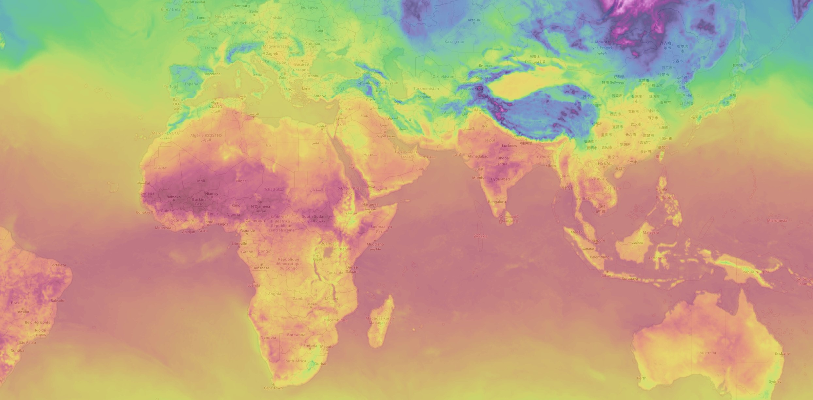

# ol-heatmap-tile

ol plugin for rendering grayscale images



# Example

```js
import HeatmapTile from "ol-heatmap-tile";

const heatmap = new HeatmapTile({
  /* Base options */
  url: "https://petyaogurkin.github.io/ol-heatmap-tile/examples/temp.jpg" /* Grayscale image url */,
  // data: {                                  /* It is also possible to pass data directly */
  //      grid: new UInt8Array(),             /* Image converted to TypedArray */
  //      width: 0                            /* Width of original image */
  // },

  /* Secondary options */
  // dataBbox: [19, 41, -168, 82],            /* Extents of original image in LonLat bbox (default [-180, -90, 180, 90]) */
  // renderBbox: [19, 41, -168, 82],          /* Extents of output layer in LonLat bbox (default equals dataBbox) */
  // projection: 'EPSG:3576',                 /* Custom projection (default 'EPSG:3857') */
  // tileGrid: new ol.tilegrid.TileGrid(),    /* ol.tilegrid.TileGrid for non 'EPSG:3857' projections */
  // compression: 8,                          /* Detalization of layer (default 4) */
  // colorSchema: [                           /* Custom color scheme, generates control point gradient */
  //      0, '#FF0000',
  //      50, '#00FF00',
  //      100, '#0000FF'
  // ],

  /* Numeric grid options */
  // renderValues: false,                     /*  If true instead of heatmap will render numeric grid (default false) */
  // valueMiniMaxes: [-100, 100],             /*  Minimaxes for scale values of original image  (default [0, 255]) */
  // valueRoundDigits: 2,                     /*  Rounding values on numeric grid (default 0) */
  // valuesFont: '24px Arial',                /*  Font of numeric grid values (defalut '24px sans-serif') */
  // valuesColor: '#000',                     /*  Color of numeric grid values (default '#fff') */

  /* Options for ol.layer.WebGLTile see https://openlayers.org/en/latest/apidoc/module-ol_layer_WebGLTile-WebGLTileLayer.html */
  olOptions: {
    opacity: 0.7,
  },
});
```
